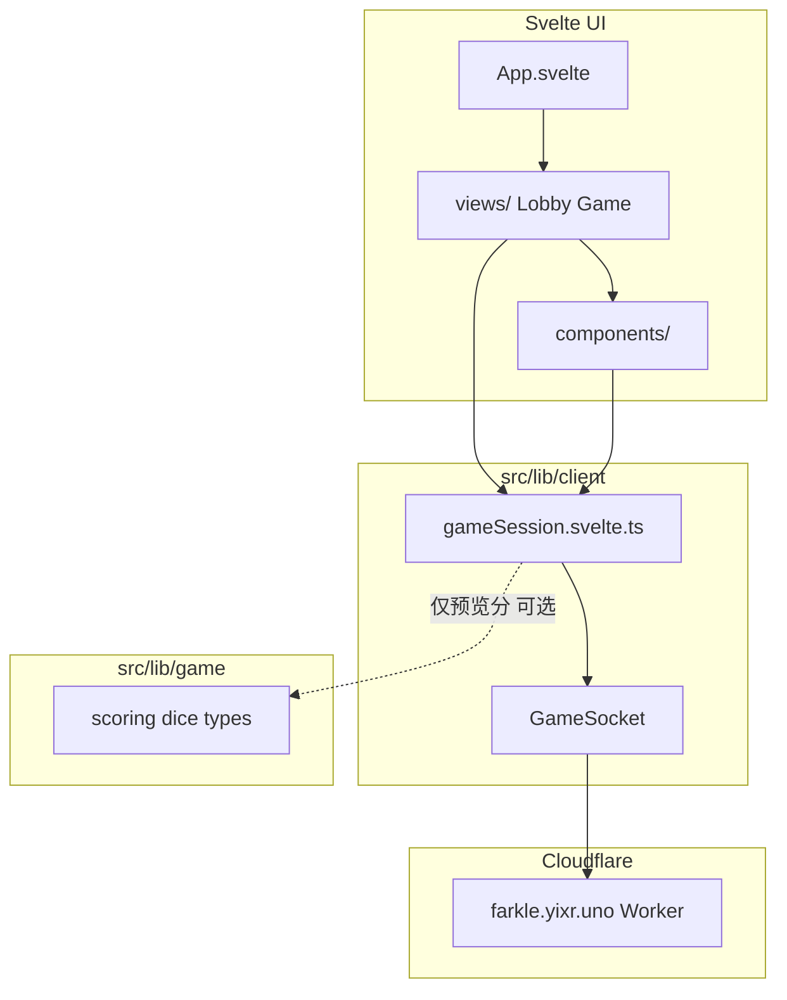

# Memory — 项目上下文备忘（Agent / 维护者）

> **仓库：** [yixr-github/ytq_KCD2-Farkle](https://github.com/yixr-github/ytq_KCD2-Farkle)  
> **在线：** [https://farkle.yixr.uno](https://farkle.yixr.uno) · Pages 项目 `kcd2-farkle` · Worker `ytq-kcd2-farkle-api`  
> **状态：** MVP 已上线（前端 Pages + Worker API）；非上游 P2P 版，勿恢复 Trystero  
> **最后更新：** 2026-06-04（联机 UX · 大厅路由 · 魔鬼骰贴图 · 选骰间距 · 文档同步）  
> **版权：** [`NOTICE.md`](NOTICE.md)（fork 自 [luyu14039/KCD2-Farkle](https://github.com/luyu14039/KCD2-Farkle)）  
> **设计：** [`docs/kcd2-farkle/DESIGN.md`](docs/kcd2-farkle/DESIGN.md) · [`UI-REVIEW.md`](docs/kcd2-farkle/UI-REVIEW.md) · [`worker/README.md`](worker/README.md)

本文档供**新会话 Agent**与维护者快速恢复上下文。Phase F 为后续增强（见 §1.2）。

---

## 0. 新会话阅读顺序（建议 5–10 分钟）

| 顺序 | 文件 | 目的 |
|------|------|------|
| 1 | [`README.md`](README.md) | 结构、命令、环境变量、文档索引 |
| 2 | **本文 §1** | 已有功能、URL、联机坑点 |
| 3 | [`NOTICE.md`](NOTICE.md) | 上游致谢、非商业、KCD2 免责 |
| 4 | **本文 §2** | 架构原则（服务器权威、勿直连 WS） |
| 5 | [`worker/README.md`](worker/README.md) | WS 协议、`/room/*` 路由、部署 |
| 6 | [`docs/README.md`](docs/README.md) | 文档总索引 |
| 7 | [`docs/ui-copy-catalog.md`](docs/ui-copy-catalog.md) | 改中文案时对照 |
| 8 | [`docs/kcd2-farkle/DESIGN.md`](docs/kcd2-farkle/DESIGN.md) | UI token（改样式时） |
| 9 | [`docs/pages-deploy.md`](docs/pages-deploy.md) | 发布与 DNS |

**本地开发：** 终端 1 `yarn worker:dev`（8787）+ 终端 2 `yarn dev`（5173）。  
**勿做：** 从 Git 历史恢复 `gameStore`、Trystero、`DicePhysicsStage` / Matter-Pixi 物理层。

---

## 1. 项目当前快照

### 1.1 已有（规则 + 联机 + 前端 MVP）

| 路径 | 内容 |
|------|------|
| `src/lib/game/diceDescriptions.ts` | 39 种骰风味描述（来源 `docs/dice/骰子概率+描述.md`） |
| `src/lib/game/diceRegistry.ts` | 39 种骰定义 + 权重（权威） |
| `src/lib/protocol/messages.ts` | WS 消息类型 `ClientMessage` / `ServerMessage` |
| `src/lib/client/` | `config.ts`、`GameSocket.ts`、`gameSession.svelte.ts` |
| `src/views/` | `LobbyView.svelte`、`GameView.svelte` |
| `src/components/` | `layout/`（`Header`、`TavernAmbience`）、`game/`、`lobby/` |
| `src/components/layout/TavernAmbience.svelte` | 暗色烛光 + emoji + 六枚特殊骰（Aranka/Devil/HolyTrinity/King/Pie/Charioteer）依次发光 |
| `src/components/selection/DiceWeightLegend.svelte` | 六面概率图例（选骰 / 图鉴共用） |
| `index.html`、`main.ts`、`App.svelte`、`app.css` | Svelte 5 入口与设计 token |
| `worker/` | Cloudflare Worker + Durable Object |
| `UnitTest/` | 单元测试（`yarn test`，scoring / session / diceThemes / diceTextures 等） |
| `NOTICE.md` | 上游致谢、Warhorse 免责、非商业与再分发 |
| `worker/src/session.ts` | 回合逻辑、`lastBust`、`leavePlayer`、Hot Dice |
| `worker/src/game-room.ts` | WebSocket、广播、DO storage |
| `docs/dice/骰子概率+描述.md` | 39 种骰子概率 + 风味描述（同步至 `diceDescriptions.ts`） |
| `docs/dice/骰子模板.md` | 39 种骰主题 fill/border/pip/icon；生成规则说明 |
| `docs/game/dice-weights.json` | 权重 JSON 参考（权威在 `diceRegistry.ts`） |
| `scripts/generate-themed-dice.mjs` | 读取 `diceThemes.json` → `public/dice/{DieId}/` |
| `src/lib/assets/diceIcons.ts` | 主题 icon 矢量片段（与生成器逻辑对齐） |
| `docs/kcd2-farkle/DESIGN.md` | UI 设计系统 v2 |
| `docs/kcd2-farkle/ui-reference-mockup.png` | 外部设计效果图 |
| `public/dice/{DieId}/*.svg` | 主题骰面（hidden + 1–6 + devil，`yarn dice:generate`） |
| `public/dice/ivory/*.svg` | 通用骨色面（图鉴/大厅装饰） |
| `src/lib/assets/diceThemes.json` | 39 种骰主题（`docs/dice/骰子模板.md`） |
| `src/lib/assets/diceTextures.ts` | `getThemedFaceUrl` / `getPlaceholderFaceUrl` |
| `src/lib/ui/playDiceRollAnimation.ts` | GSAP 四段掷骰（收拢→飞散→回槽） |
| `src/lib/settings/gameSettings.ts` | 含 `physicsEnabled` |
| `.env.development` / `.env.production` / `.env.example` | `VITE_WS_BASE` |
| `public/_redirects` | Cloudflare Pages SPA 回退 |
| `docs/pages-deploy.md` | Pages 部署说明 |

### 1.2 尚未做（Phase F / 运维）

- Cloudflare Pages **连 GitHub Actions 自动部署**（已支持 `wrangler pages deploy` 一次性上传，见 [`docs/pages-deploy.md`](docs/pages-deploy.md)）
- `rps` / `draft_rps` 完整 UI
- 断线重连 UI、粒子 / 旁白、图鉴六面改为主题色预览、骰杯倒出真 3D
- `src/lib/ui/breakpoints.ts`、`useMediaQuery.svelte.ts`（可选，未建）
- Playwright / 真机验收（DoD §13 第 6–7 条，发布前补测）

### 1.3 旧代码说明

Git 历史中曾有旧版 `src/components/`、`gameStore.ts`、Trystero P2P 等——**勿恢复**。当前 `src/components/` 为 2026-06 MVP 按 DESIGN.md 重写，对接 Worker WebSocket。

### 1.4 环境与 URL（已确认）

| 环境 | WebSocket | HTTP 健康检查 |
|------|-----------|---------------|
| 生产 | `wss://farkle.yixr.uno/room/{roomId}` | `https://farkle.yixr.uno/health` |
| 本地 Worker | `ws://127.0.0.1:8787/room/{roomId}` | `http://127.0.0.1:8787/health` |
| 本地前端 | `http://localhost:5173` | `yarn dev` |

Worker 内部名称：`ytq-kcd2-farkle-api`（Cloudflare 控制台名，与对外域名无关）。

**对外统一域名：** `farkle.yixr.uno` — 理想形态为 **Pages 托管页面** + **Worker 路由** `farkle.yixr.uno/room/*`（WebSocket）。勿把整条域名只绑在 Worker 自定义域上，否则浏览器打开 `/room/xxx` 会看到 API 纯文本（已用 `PAGES_HOST` 代理缓解，见 `worker/wrangler.toml`）。

### 1.4.1 URL、邀请链接与刷新

| URL | 行为 |
|-----|------|
| `/` | 大厅 **主菜单**；点「进入酒馆」→ **新开一桌**（`JoinForm` 默认 create 标签） |
| `/room/{id}` | **推荐邀请链接**（仅房间号）。进大厅 **加入骰局**（`joinOnly`），预填房间暗号 |
| `/room/{id}?name=昵称` | 进大厅并**预填**昵称（须确认加入）；**勿**在邀请链接里带房主昵称（会与房主同名导致占房主位） |
| `/room/{id}` + `sessionStorage` 有 `farkle-player-name` | 若本地曾玩过，可能直连对局（`App.svelte` 逻辑） |

**复制邀请链接：** `GameView` → `shareUrl(roomId)` **不含** `name`（`copyInviteLink`）。  
对局状态在 **Durable Object**（`lastBust` 等字段在 `GameState`）；Worker 重启或 DO 冷启动后需重开。无完整断线重连 UI。

### 1.4.2 多房间与换房

- **不同房间号** 可并行存在（每房间一个 DO），多组玩家互不影响。
- **同一浏览器标签** 同时只能连一个房间；换房时 `connect()` 会先 `leave` 再连新房间。
- 房主未点「离开」就另开新桌，旧房 WS 断开，对手会看到离开/Toast。

### 1.5 UI 文案（弹窗 / Toast / 提示）

完整清单见 **[`docs/ui-copy-catalog.md`](docs/ui-copy-catalog.md)**（改措辞时优先查此表）。

| 类型 | 主要文件 |
|------|----------|
| 阶段提示（爆点 / 换手 / 胜负；Hot Dice 多为盘内轻提示） | `PhaseOverlay.svelte`（爆点：底部紧凑条 + **仅展示本次掷出的未保留骰** `lastBust`） |
| 大厅弹窗（规则 / 设置 / 图鉴） | `RulesSheet.svelte`、`SettingsPanel.svelte`、`DiceCollectionPanel.svelte`（图鉴） |
| 房内规则卡片 | `RulesConfigPanel.svelte` |
| 顶栏 Toast 错误 | `gameSession.svelte.ts` + `worker/src/session.ts` |
| 选骰页 | `DiceSelector.svelte` |
| 底栏等待与三键 | `ActionBar.svelte` + `GameView` 内 `lobbyWaitText` / `getDicePickWaitText` |
| 组合横幅（英文） | `src/lib/ui/scoringLabels.ts` |
| 酒馆随机语录 | `tavernQuotes.ts` + `TavernQuoteBar.svelte` + `useTavernQuote.svelte.ts` |
| 特殊骰标注 | `DiceBoard.svelte` 骰子下方 `shortName` |

**注意：** 服务端错误文案经 WS 原样显示在 Toast；改中文需同时改 `worker/src/session.ts`（及必要时 `game-room.ts`）。

### 1.6 UI 视觉（2026-06 v2 深色沉浸）

- **主调：** DESIGN v2 — 深木底 `#1a120b`、木桌聚光 `DiceTable`、烫金描边 `.btn-gilded`；计分用 gold + 羊皮纸 `panel-parchment`。
- **对局组件：** `GameHud` / `DiceBoard` / `DicePiece` / `TurnScoreCard` / `FloatingScore` / `ComboBanner`（`ScoreRulesPanel.svelte` 保留未挂载，得分表见大厅规则）。
- **大厅：** `MainMenu` 参考稿布局：全宽「进入酒馆」+ 双列「骰子图鉴」「规则说明」+ 底栏「设置」；烫金外框、图标/标题/副标题**居中**；`JoinForm` 等弹层不变。
- **骰子图鉴：** `DiceCollectionPanel.svelte` 读 `diceRegistry`（39 种）+ `getDieDescription` 右侧风味描述；复用 `DiceCard`（`readonly`）+ `DiceWeightLegend`；分类 Tab 与 `CATEGORY_LABELS` 一致；**不**影响对局。
- **背景：** `TavernAmbience.svelte`（烛光 + 暗角 + 低对比 emoji + 六枚特殊骰隐藏面 SVG 依次高亮）；骰子层在 vignette **之上**；`absolute inset:0`。
- **对局布局（参考 PC 稿）：** 单列居中 `game-page__center`（`margin-block: auto` 于 HUD 与底栏之间）— `DiceTable` → `TurnScoreCard` 双卡：**本轮累计**（选中预览分，大号 `+N`）| **当前回合累积**（已确认 `turnScore`）。对局内**无** `ScoreRulesPanel`。
- **骰盘：** 手机 3×2；**≥768px 六枚一排**；`game-page__stage` 手机顶对齐、桌面垂直居中；**已移除** `ThrowPips`。
- **选骰页：** `DiceSelector` 标题区与顶栏 `Header` 之间留 `padding-top`（`game-page__main--pick` + 标题区），避免「选择特殊骰子」贴顶。
- **GameHud：** 左「你」、中「目标」、右「对手」；默认头像 `public/avatars/hud-you.jpg` / `hud-opponent.jpg`；昵称 `min-width:0` + ellipsis，长名不撑宽；当前回合 ♛。
- **骰子贴图：** 对局按 `die.type` 加载主题 SVG；`DevilDie` 的 `wildcardFace`（1 点）与 `value===0` 均显示恶魔头（`face-devil`）；图鉴六面预览用 `getCatalogFaceUrl`（百搭面用主题恶魔图，其余 ivory）。主题数据 `diceThemes.json`；生成 `yarn dice:generate`。
- **掷骰动画：** `playDiceRollAnimation`（GSAP，DOM 克隆 overlay）；`GameView` 在己方回合且 `rollCount` 增加时设 `physicsRolling`，`DiceBoard` 测量槽位并播放（约 850ms）；`settings.physicsEnabled` 关闭或 `prefers-reduced-motion` 时回退 CSS `medievalRoll`。
- **布局注意：** 背景 `TavernAmbience` 用 **`absolute inset:0`**（父级 `lobby-root`/`game-root` 设 `position:relative; min-height:100svh`），**勿** `fixed`（桌面 Chrome 点击空白会滚到底露底色）。全页高度**只设一处** `min-height:100svh`；footer `margin-top:auto`。

### 1.7 主题骰 SVG 维护

| 步骤 | 说明 |
|------|------|
| 1 | 在 [`docs/dice/骰子模板.md`](docs/dice/骰子模板.md) 查阅说明，修订 [`src/lib/assets/diceThemes.json`](src/lib/assets/diceThemes.json) |
| 2 | 运行 `yarn dice:generate`（[`scripts/generate-themed-dice.mjs`](scripts/generate-themed-dice.mjs) + [`scripts/diceSvgCore.mjs`](scripts/diceSvgCore.mjs)） |
| 3 | 输出至 `public/dice/<DieId>/`：`face-hidden.svg`、`face-1.svg`…`face-6.svg`、`face-devil.svg` |
| 4 | 对局运行时经 [`getThemedFaceUrl`](src/lib/assets/diceTextures.ts) / [`getPlaceholderFaceUrl`](src/lib/assets/diceTextures.ts) 按 `die.type` 解析 |

**规则摘要：** `hidden` 仅显示主题 icon；`1`–`6` 为标准点位 + 主题色；`DevilDie` 的 `face-1` 与 `face-devil` 为恶魔图；`RollThreeDie` hidden 为数字 3 徽章。新增 registry 骰种时须同时补 `diceThemes.json` 并重新生成。

### 1.8 联机、房间与离开（2026-06）

| 行为 | 实现 |
|------|------|
| 多房间并存 | 不同 `roomId` → 不同 DO 实例；**支持**多桌同时进行 |
| 单客户端双房间 | **不支持**（`GameSocket` 单例）；换房 `connect` 会先 `leave` |
| 房主离开 | `leave` → `leavePlayer` + 广播；对方 Toast「对手已离开牌桌」 |
| 爆点 | `endTurn` 写入 `lastBust`（仅 `active && !kept` 骰）；`PhaseOverlay` 展示 ~3.1s |
| Hot Dice | `hotDiceFromKeep` 保持 `selecting`，`turnScore>0` 时不显示首掷背面 |
| Worker 非 WS 访问 `/room/*` | `index.ts` 代理至 `PAGES_HOST`（默认 `kcd2-farkle.pages.dev`） |

---

## 2. 架构原则（实施时必须遵守）



1. **服务器权威**：`GameState` 以 WS 下发的 `state` 为准，UI 不自行 `rollDice` 改状态。
2. **UI 不 import 网络**：组件只读 `gameSession.svelte.ts` 导出的 `session` / actions，不直接 `new WebSocket`。
3. **计分展示**：优先显示服务端 `turnScore` / `players[].totalScore`；选中预览可本地调用 `evaluateSelection`（可选，需与服务器 keep 校验一致）。
4. **设计 token**：样式只用 `docs/kcd2-farkle/DESIGN.md` / `src/app.css` 中的 CSS 变量，不硬编码 Starbucks 绿。
5. **Responsive / Mobile-first**：**三端都要适配**——手机、平板、桌面浏览器；默认样式按手机写，再用 `@media (min-width: …)` 增强大屏；不是「只做手机版」。

---

## 3. 响应式适配（Mobile-first，含平板 / 桌面 Web）

> 详细视觉 token 见 DESIGN.md §6。本节规定 **手机 + 平板 + 桌面浏览器** 的实施约束与验收标准。

### 3.1 设计策略

- **默认视口：** 375×667（iPhone SE 档）为基准稿，不是桌面缩小版。
- **单手持握：** 核心操作（掷骰、保留、收分）落在拇指可达区（屏幕下半 + 固定底栏）。
- **信息优先级：** 手机一屏内必须同时看到：**当前回合分（gold）** + **至少 4 枚骰子** + **主操作按钮**；总分可折叠或压缩为顶栏条。
- **不做原生 App：** 纯响应式 Web；不依赖安装，分享链接即玩。

### 3.2 `index.html` 与全局 CSS（Phase A 必做）

```html
<meta name="viewport" content="width=device-width, initial-scale=1, viewport-fit=cover" />
<meta name="theme-color" content="#2c1810" />
<meta name="apple-mobile-web-app-capable" content="yes" />
<meta name="apple-mobile-web-app-status-bar-style" content="black-translucent" />
```

```css
/* app.css — 移动端补充变量 */
:root {
  --header-height-mobile: 48px;
  --action-bar-height-mobile: 64px;
  --die-size-mobile: 52px;          /* 最小触控目标，见 3.4 */
  --die-gap-mobile: 0.5rem;
  --layout-gutter: 1rem;          /* 左右安全边距 */
  --safe-bottom: env(safe-area-inset-bottom, 0px);
  --safe-top: env(safe-area-inset-top, 0px);
}

html {
  -webkit-text-size-adjust: 100%;
  touch-action: manipulation;       /* 禁用双击缩放延迟 */
}

body {
  min-height: 100dvh;               /* 动态视口，避免地址栏遮挡 */
  overflow-x: hidden;
  overscroll-behavior-y: contain;   /* 减少橡皮筋误触刷新 */
}
```

### 3.3 断点与布局（与 DESIGN.md 对齐）

| Breakpoint | 宽度 | 布局要点 |
|------------|------|----------|
| **mobile（默认）** | < 640px | 见 3.5 线框 |
| tablet | 640–1024px | 骰子 3×2，计分板双列展开 |
| desktop | > 1024px | max-width 960px 居中，骰子横排 6×1 |

**媒体查询约定：** 移动优先写默认样式，再用 `@media (min-width: 640px)` 增强。

```css
@media (min-width: 640px) { /* tablet+ */ }
@media (min-width: 1024px) { /* desktop */ }
```

### 3.4 触控与交互

| 规则 | 要求 |
|------|------|
| 最小点击区域 | **44×44px**（Apple HIG）；骰子 tile 可视 52px+，含 padding |
| 按钮间距 | 相邻可点元素 gap ≥ 8px，防误触 |
| 骰子选择 | **点击 toggle**（不用 hover-only）；选中态明显（wine 描边 + tint） |
| 长按 | MVP 不用；避免与系统菜单冲突 |
| 双击缩放 | `touch-action: manipulation` 或 `user-scalable=no`（二选一，优先前者） |
| 滚动 | 对局主区尽量 **无纵向滚动**；Lobby 表单可滚动 |
| 反馈 | 按钮 `:active` scale(0.95)；可选 `@media (hover: none)` 加强 active 态 |

**ActionBar 手机布局：**

- 固定 `bottom: 0`，`padding-bottom: calc(var(--space-3) + var(--safe-bottom))`
- 3 个主按钮：**横排等分**（重新掷骰 | 计分并再次掷出 | 计分并跳过）；窄屏可缩写（见 `ActionBar`）
- 非己方回合：底栏显示「等待对手…」，按钮 disabled 但仍占位（避免布局跳动）

**可选增强（Phase F）：** 主操作「掷骰」在轮到我且可掷时，额外显示 FAB（DESIGN.md §4.1 Icon FAB）。

### 3.5 手机线框

**大厅 — 主菜单（`/`）：**

```text
┌──────────────────────────┐
│ ♛ 骰子酒馆      ● 已连接   │  Header（大厅无房间号）
├──────────────────────────┤
│         ♛                  │
│      骰子酒馆               │
│ 天国拯救2·特罗斯基，1403年   │
│ ┌────────────────────────┐ │
│ │  🎲 进入酒馆            │ │  烫金框，图标/文案居中
│ │  开始你的骰子对决       │ │
│ └────────────────────────┘ │
│ ┌───────────┬────────────┐ │
│ │📖骰子图鉴 │📜规则说明   │ │
│ └───────────┴────────────┘ │
│       [ ⚙ 设置 ]           │
├──────────────────────────┤
│   联机 · farkle.yixr.uno    │
└──────────────────────────┘
```

**大厅 — 进房（`MainMenu` → `JoinForm`）：**

```text
┌──────────────────────────┐
│ ♛ 骰子酒馆      ● 已连接   │
├──────────────────────────┤
│ ← 返回主菜单               │
│ [新开一桌] | [加入牌局]     │
│ 旅人昵称 [________]        │
│ 房间暗号 [______]          │
│ [      进入酒馆      ]     │
│ ▼ 怎么玩？                 │
└──────────────────────────┘
```

**对局 — selecting（`GameView`）：**

```text
┌──────────────────────────┐  ← safe-top
│ ♛ 骰子酒馆  ABC123  ● 离开│  Header 48px
├──────────────────────────┤
│[你] 你      │目标│ 对手 [对]│  GameHud：JPG 头像
│ 222  1200  │4000│ 111  800 │
├──────────────────────────┤
│    （stage 垂直居中）       │
│ ┌────────────────────────┐│
│ │ 摇出骰子                ││  DiceTable
│ │ 点击骰子区域即可重新摇骰 ││
│ │  ┌──┬──┬──┐            ││
│ │  │3 │3 │3 │  3×2 网格   ││
│ │  ├──┼──┼──┤            ││
│ │  │1 │5 │2 │            ││
│ │  └──┴──┴──┘            ││
│ └────────────────────────┘│
│ ┌本轮累计┐ ┌当前回合累积┐ │  TurnScoreCard 双羊皮纸
│ │ +1050  │ │   350      │ │
│ └────────┘ └────────────┘ │
├──────────────────────────┤
│[重新掷骰][计分并再次掷出]   │  ActionBar + safe-bottom
│        [计分并跳过]        │
└──────────────────────────┘
```

**Lobby 手机（要点）：**

- 表单单列全宽 input（`font-size: 16px` 防止 iOS 聚焦放大）
- 主菜单：参考稿烫金框三按钮（进入酒馆 / 图鉴+规则双列 / 设置）；进房表单内「进入酒馆」仍为全宽 CTA
- 「复制房间链接」按钮：调用 `navigator.clipboard` + toast（方便微信/QQ 分享）

### 3.6 手机特有场景

| 场景 | 处理 |
|------|------|
| 微信 / QQ 内置浏览器 | 不测极端兼容；保证标准 WebSocket + HTTPS；分享链接用 `https://farkle.yixr.uno/room/XXX` |
| 横屏 | MVP 仍可用：骰子改 6×1 或 3×2，顶栏压缩；不单独做横屏稿 |
| 键盘弹出（输入昵称） | Lobby 表单 `scrollIntoView`；对局页无输入框 |
| 切后台 / 锁屏 | WS 可能断；MVP toast「连接已断开」，Phase F 重连 |
| 低性能机 | 减少 box-shadow 层数；掷骰动画 ≤ 400ms；不用大面积 blur |
| 省流量 | 首屏无大图；SVG 图标；不 autoplay 视频 |

### 3.7 组件级移动端 checklist（Phase D）

- [x] `Header.svelte`：高度 48px，房间号过长 `truncate`
- [x] `GameHud.svelte`：左你/右对手 + `public/avatars/`；目标居中
- [x] `DiceBoard.svelte`：mobile `repeat(3, 1fr)`；`DicePiece` ≥44px 可点
- [x] `TurnScoreCard.svelte`：双卡「本轮累计」「当前回合累积」
- [x] `ActionBar.svelte`：fixed bottom + safe-area；三键文案见 §3.5
- [x] `PhaseOverlay.svelte`：全屏 overlay；bust/hot_dice/game_over
- [x] `JoinForm.svelte`：input `font-size: 16px`；primary 按钮全宽
- [x] Toast / error：顶栏下 fixed toast，不挡 ActionBar

### 3.8 移动端测试（纳入 DoD）

**浏览器 DevTools 设备模拟（开发期）：**

- iPhone SE（375）
- iPhone 14 Pro（393）
- 安卓常见宽 360

**真机必测（发布前至少 1 台 iOS + 1 台 Android）：**

1. 打开分享链接进房间
2. 完整打一局：join → start → roll → keep → bank
3. 拇指单手可完成全部点击
4. 地址栏显隐时底栏不被裁切（`100dvh` + safe-area）
5. 旋转横屏不崩布局

**可选工具：** Playwright `devices['iPhone 13']` 冒烟；非替代真机。

### 3.9 目录补充（响应式相关）

```text
src/lib/ui/               # 可选，MVP 未建
  breakpoints.ts          # BREAKPOINT_SM = 640, LG = 1024
  useMediaQuery.svelte.ts # matchMedia 封装
```

> MVP 用 CSS `@media` 断点实现响应式，未引入 `src/lib/ui/`。

### 3.10 平板与桌面 Web 增强

> **Mobile-first ≠ 只做手机。** 大屏是增强层，MVP 必须在 **375px 手机** 与 **≥1024px 桌面** 两种宽度下都可完整对局。

#### 平板（640px – 1024px）

- 页面仍 `max-width: 100%`，左右 `layout-gutter` 加大到 `1.5rem`
- 骰子：**3×2 网格**，单枚可放大到 64px
- `GameHud` + `TurnScoreCard`：与手机同构，字号略放大
- `ActionBar`：可仍为 fixed bottom，或改为骰盘下方 inline（视高度而定）
- Lobby：表单 max-width 480px 居中，不必全宽

#### 桌面 Web（> 1024px）

**布局：**

```text
┌────────────────────────────────────────────────────────┐
│  ♛ 骰子酒馆              ABC123    ● 已连接  [离开]     │  header 56px
├────────────────────────────────────────────────────────┤
│  max-width min(720px HUD, 640px 骰盘) 居中              │
│  [你头像] 你 1200  │  目标 4000  │  对手 800 [对手头像]   │  GameHud
├────────────────────────────────────────────────────────┤
│              game-page__stage 垂直居中                  │
│  ┌────────────────────────────────────────────────┐   │
│  │ 摇出骰子 · 点击骰子区域即可重新摇骰               │   │
│  │  [3][3][3][1][5][2]  ← ≥768px 六枚横排          │   │  DiceTable+Board
│  └────────────────────────────────────────────────┘   │
│     ┌ 本轮累计 +1050 ┐    ┌ 当前回合累积 350 ┐          │  TurnScoreCard
├────────────────────────────────────────────────────────┤
│  [ 重新掷骰 ]  [ 计分并再次掷出 ]  [ 计分并跳过 ]        │  ActionBar（≥1024 可非 fixed）
└────────────────────────────────────────────────────────┘
```

**CSS 要点：**

```css
@media (min-width: 1024px) {
  :root {
    --header-height: 56px;
    --action-bar-height: 72px;
    --die-size: 72px;
    --layout-max-width: 960px;
  }
  .game-shell {
    max-width: var(--layout-max-width);
    margin-inline: auto;
    padding-inline: var(--space-4);
  }
  .dice-tray {
    grid-template-columns: repeat(6, 1fr); /* 6×1 横排 */
    max-width: 560px;
  }
  /* 桌面不必 fixed 底栏，避免宽屏下按钮离骰子太远 */
  .action-bar--desktop {
    position: sticky;
    bottom: var(--space-4);
  }
}
```

**鼠标 / 键盘（桌面独有，触控仍保留）：**

| 交互 | 行为 |
|------|------|
| Hover | 骰子、按钮 `:hover` 亮度 +1.05；**不能** hover-only 才能操作 |
| Cursor | 可点元素 `cursor: pointer` |
| 键盘（Phase F 可选） | `R` 掷骰、`K` 保留、`B` 收分；MVP 可不实现 |
| 选中骰子 | 点击 toggle，与手机相同 |

**Lobby 桌面：**

- 居中卡片（max-width 420px），两侧留白
- 鼠标 hover 主按钮；focus-visible 描边（无障碍）

#### 桌面 / 平板 checklist（Phase D）

- [x] `≥1024px`：`.game-shell` max-width 960px 居中
- [x] 骰子 6×1 横排（`DiceBoard` `@media min-width: 768px`）
- [x] ActionBar 桌面 sticky（`@media min-width: 1024px`）
- [x] Header 高度 56px（`:root` `@media min-width: 1024px`）
- [ ] 浏览器窗口 1280→375 无崩溃（DevTools 待 smoke）
- [ ] Chrome / Firefox / Edge / Safari 桌面各 smoke 一次

### 3.11 响应式测试（纳入 DoD，与 §3.8 并列）

| 宽度 | 场景 |
|------|------|
| 375px | 手机（§3.8 真机 + 模拟） |
| 768px | iPad 竖屏 / 小平板 |
| 1280px | 常见笔记本桌面 |
| 1920px | 大屏：仍 960px 居中，两侧 cream 留白，不无限拉宽 |

**DoD 响应式：** 上述 4 档宽度均能完成一局；桌面与手机各至少测一次。

---

## 4. 当前目录结构

```text
KCD2-Farkle/
  index.html
  svelte.config.js
  vite.config.ts              # svelte 插件 + $lib alias + vitest
  src/
    main.ts
    app.css                   # DESIGN.md CSS 变量 + 移动端全局
    App.svelte                # pathname 路由：/ → Lobby，/room/:id → Game
    vite-env.d.ts
    lib/
      game/                   # 规则引擎
      protocol/               # WS 消息类型
      client/
        config.ts             # WS_BASE、roomUrl、generateRoomId、shareUrl
        GameSocket.ts         # WebSocket 单例封装
        gameSession.svelte.ts # Svelte 5 runes session + actions
    views/
      LobbyView.svelte
      GameView.svelte
    components/
      layout/Header, ActionBar, TavernAmbience
      game/GameHud, DiceTable, DiceBoard, TurnScoreCard, PhaseOverlay, …
      lobby/MainMenu, JoinForm, DiceCollectionPanel, RulesSheet, …
  public/
    avatars/hud-you.jpg, hud-opponent.jpg
    dice/{DieId}/…、dice/ivory/…
    favicon.svg
    _redirects                # Pages SPA
  docs/pages-deploy.md
  .env.development / .env.production / .env.example
```

**刻意不做进 MVP：**

- `dice_selection` / `rps` 完整 UI（Worker session 也尚未实现）
- 粒子 / 旁白 / 图鉴六面主题色预览
- 断线重连 UI（可 Phase 2）

---

## 5. 依赖（已写入 package.json）

### 5.1 根 package.json（当前）

```json
{
  "scripts": {
    "dev": "vite",
    "build": "vite build",
    "preview": "vite preview",
    "check": "svelte-check --tsconfig ./tsconfig.app.json && tsc -p tsconfig.app.json --noEmit",
    "test": "vitest run",
    "typecheck": "tsc -p tsconfig.app.json --noEmit",
    "worker:dev": "yarn --cwd worker dev",
    "worker:deploy": "yarn --cwd worker deploy"
  },
  "devDependencies": {
    "@sveltejs/vite-plugin-svelte": "^7.0.0",
    "@tsconfig/svelte": "^5.0.8",
    "svelte": "^5.x",
    "svelte-check": "^4.x"
  }
}
```

保留现有 `vite`、`typescript`、`vitest`。继续用 **Yarn 1**，不要生成 `package-lock.json`。

### 5.2 vite.config.ts（已改）

- `@sveltejs/vite-plugin-svelte` 已启用
- `base` 默认 `/`（根域名 Pages）
- `$lib` alias 与 Vitest 保留

### 5.3 tsconfig.app.json（已改）

- `extends @tsconfig/svelte`
- `include`: `src/**/*.ts`, `src/**/*.svelte`, `UnitTest/**/*.ts`

---

## 6. 客户端会话层设计（`src/lib/client/`）

### 6.1 `config.ts`

```typescript
export const WS_BASE =
  import.meta.env.VITE_WS_BASE ?? 'wss://farkle.yixr.uno';

export function roomUrl(roomId: string): string {
  const id = roomId.trim().toUpperCase();
  return `${WS_BASE}/room/${encodeURIComponent(id)}`;
}
```

### 6.2 `GameSocket.ts` 职责

- `connect(url: string): Promise<void>`
- `send(msg: ClientMessage): void`
- 事件：`onState(state, you)`, `onError(message)`, `onClose`, `onOpen`
- 自动 JSON parse / stringify（用 `protocol/messages.ts`）
- 断线：MVP 只 toast，不自动重连

### 6.3 `gameSession.svelte.ts` store 形状（已实现）

```typescript
interface SessionStore {
  connected: boolean;
  connecting: boolean;
  roomId: string | null;
  you: PlayerId | null;
  state: GameState | null;
  lastError: string | null;
  selectedDieIds: number[];  // 本地 UI 多选，keep 前
}
```

**Actions（封装 send）：**

| 方法 | 发送 | 前置条件 |
|------|------|----------|
| `connect(roomId, name)` | 连接后 `join` | — |
| `startGame(config?)` | `start` | `you === 'host'` |
| `roll()` | `roll` | `isMyTurn` |
| `keepSelection()` | `keep` + `selectedDieIds` | 选中合法 |
| `bank()` | `bank` | `turnScore > 0` |
| `toggleDie(id)` | — | 本地 only |
| `clearSelection()` | — | 本地 only |

**Derived（导出 getter 函数，组件内 `$derived(getCanRoll())` 等）：**

- `getIsMyTurn()` / `getPhase()` / `getCanRoll()` / `getCanKeep()` / `getCanBank()` / `getCanStart()` / `getSelectionPreview()`

### 6.4 按钮可用性矩阵（MVP，对齐 worker/session.ts）

| phase | 掷骰 | 保留 | 收分 |
|-------|------|------|------|
| `lobby` | — | — | — |
| `selecting` | ✓ 轮到我且 `!awaitingKeep` | ✓ 有合法选中 | ✓ turnScore>0 |
| `rolling` | — | — | — |
| `bust` / `turn_end` / `hot_dice` | 下一轮掷骰前 normalize | — | — |
| `game_over` | — | — | — |

收到 `bust` / `turn_end` 后 Worker 会在下次操作前 normalize；UI 可显示 PhaseOverlay 1–2 秒后自动 dismiss。

---

## 7. 视图与组件实施顺序

### Phase A — 脚手架 ✅

- [x] 恢复 `index.html`、`main.ts`、`svelte.config.js`
- [x] `index.html` 移动端 meta（§3.2）
- [x] 更新 `vite.config.ts`、`package.json`、`tsconfig.app.json`
- [x] `src/app.css` DESIGN token + 移动端全局样式
- [x] `App.svelte` 路由壳
- [x] `yarn dev` / `yarn test` / `yarn typecheck` / `yarn run check` 通过

### Phase B — 会话层 ✅

- [x] `lib/client/config.ts`
- [x] `lib/client/GameSocket.ts`（单例 `getGameSocket()`）
- [x] `lib/client/gameSession.svelte.ts`
- [x] 双 tab join → start → roll 可联调（需 `yarn worker:dev`）

### Phase C — Lobby ✅

- [x] `LobbyView.svelte` + `JoinForm.svelte`
- [x] 手机全宽表单、input 16px、复制房间链接
- [x] 6 位房间码 `generateRoomId()`
- [x] URL `/room/:id`，query `?name=` 预填；无 name 时留在大厅
- [x] 连接成功跳转 GameView

### Phase D — 对局 MVP ✅

- [x] `GameView.svelte` + 全部对局组件
- [x] §3.7 mobile checklist
- [x] 选中预览分（`evaluateSelection`）
- [ ] DevTools 375px / 真机完整对局（发布前补测）

### Phase E — 部署（部分 ✅）

- [x] `yarn build` → `dist/`
- [x] `docs/pages-deploy.md`、`.env.production`、`public/_redirects`
- [ ] Cloudflare Pages 连 GitHub 自动部署
- [ ] 控制台环境变量 `VITE_WS_BASE=wss://farkle.yixr.uno`
- [ ] 域名 `farkle.yixr.uno` Pages 绑定确认

### Phase F — 增强（后续）

- [x] 特殊骰子选骰 UI + Worker `pickDice` / `dice_selection`（`RulesConfigPanel`、`DiceSelector`、`pendingPickIds`）
- [ ] RPS、draft 选骰模式
- [ ] 断线重连、房间持久化（DO storage）
- [ ] 动画、音效、骰子皮肤

---

## 8. 路由方案（推荐简单版，不引入 router 库）

```typescript
// App.svelte 伪代码
const path = window.location.pathname;
const roomMatch = path.match(/^\/room\/([^/]+)/);
// roomMatch ? GameView : LobbyView
```

- 创建房间：`JoinForm` 生成 6 位码 → connect → `pushState` 到 `/room/${id}?name=…`
- 分享链接：`shareUrl()` → `https://farkle.yixr.uno/room/ABC123?name=亨利`
- 直达 `/room/:id` 无 `?name=` 时：**留 LobbyView** 预填房间号，`joinOnly` + 加入标签
- 直达 `/` 时：主菜单 → 进入酒馆 → **新开一桌**（`initialTab=create`）

若后续路由变复杂再考虑 `svelte-spa-router`。

---

## 9. 环境变量

| 文件 | 变量 | 值 |
|------|------|-----|
| `.env.development` | `VITE_WS_BASE` | `ws://127.0.0.1:8787` |
| `.env.production` | `VITE_WS_BASE` | `wss://farkle.yixr.uno` |

`.env*` 加入 `.gitignore` 若含敏感信息；上述可提交 `.env.example`。

---

## 10. 与 Worker 的协议对齐检查清单

客户端已对照 [`worker/src/session.ts`](worker/src/session.ts)：

- [x] `join` 返回 `state` + `you`
- [x] 满员后 host 才能 `start`（ActionBar / GameView lobby 区）
- [x] `roll` 仅当前玩家；爆点 → `phase: bust`
- [x] `keep` 传 `dieIds` 数组
- [x] `bank` 达到 `targetScore` → `game_over`
- [x] 错误包 toast（`session.lastError`）

**Worker 尚未实现、UI 占位文案：**

- `rps`、`draft_rps`（GameView 显示「尚未支持」）
- `endTurn` 独立消息（无，靠 bank 或 bust 切换）

---

## 11. 测试策略

| 类型 | 工具 | 范围 |
|------|------|------|
| 规则 | Vitest `UnitTest/` | 已有，不删 |
| 客户端 | 手动双 tab | join → 完整对局 |
| **移动端** | DevTools 375/393 + **真机 iOS/Android** | §3.8 五项必测 |
| UI | 可选 Playwright Phase E 后 | 大厅 → 进入房间；含 `iPhone 13` device |
| 组件 | 可选 @testing-library/svelte | DieTile 点击 toggle |

日常验证：`yarn test` → `yarn typecheck` → `yarn run check`（**勿用**裸 `yarn check`，Yarn 1 那是依赖检查）。

---

## 12. 常见坑（实施前读）

1. **Yarn 1 的 `yarn check`** 是依赖完整性检查，TypeScript 用 `yarn typecheck` 或 `yarn run check`（若 script 名为 check 且是 svelte-check）。
2. **Windows PowerShell** 不要用 `&&` 链命令，用 `;` 或分开跑。
3. **WebSocket 本地**：前端 `5173` + Worker `8787` 是跨域 WebSocket，**浏览器允许**，无需 CORS。
4. **不要在组件里新建 WebSocket**：必须单例 session，否则 HMR 双连接占满房间。
5. **Svelte 5**：用 runes（`$state`, `$derived`, `$props`），与旧版 `$:` 混用需统一。
6. **生产 WS 必须 wss**：Pages 是 https，连 ws:// 会被浏览器拦。
7. **iOS 输入框字号 < 16px** 会触发自动 zoom，Lobby 表单务必 `font-size: 16px`。
8. **fixed 底栏 + `100vh`** 在 mobile Safari 会被地址栏遮挡；用 `100dvh` + `safe-area-inset-bottom`（§3.2）。
9. **不要用 hover 作为唯一反馈**；`@media (hover: none)` 下靠 active/selected 态。

---

## 13. 实施完成定义（Definition of Done）

| # | 条件 | 状态 |
|---|------|------|
| 1 | 两浏览器 localhost 进同一房间联机 | ✅ 代码就绪，需 `worker:dev` + `yarn dev` |
| 2 | 完整 roll / keep / bank 至 4000 分 | ✅ 流程已实现 |
| 3 | UI 符合 DESIGN.md 四色 | ✅ |
| 4 | `yarn build` 成功；Pages 可访问 | ✅ `kcd2-farkle` · `farkle.yixr.uno` |
| 5 | UnitTest 144 passed（`yarn test`） | ✅ |
| 6 | 移动端真机 + 375px 验收（§3.8） | ⏳ 发布前补测 |
| 7 | 桌面 / 平板 768 / 1280px（§3.10–3.11） | ⏳ 发布前 smoke |

---

## 14. 相关命令速查

```bash
# 根目录
yarn install
yarn dev              # 前端 http://localhost:5173
yarn build
yarn preview          # 预览 dist
yarn test
yarn typecheck
yarn run check        # svelte-check（不是 yarn check）

# Worker
yarn worker:dev
yarn worker:deploy
```

---

## 15. 变更记录

> **维护约定：** 每次改 UI / 联机 / 部署，在本表追加一行，并更新文首「最后更新」。

| 日期 | 说明 |
|------|------|
| 2026-06-03 | 初稿：前端骨架 Memory，设计系统指向 kcd2-farkle/DESIGN.md |
| 2026-06-03 | 新增 §3 响应式 Mobile-first；§3.10–3.11 平板/桌面 Web；DoD 补充多端验收 |
| 2026-06-03 | **MVP 落地同步**：Phase A–D ✅；Phase E 本地 build ✅；更新 §1 快照、§4 目录、§7 checklist、§10 协议、§13 DoD |
| 2026-06-03 | **UI 第一轮**：暗金网格大厅（后弃用，易撞脸） |
| 2026-06-03 | **UI 差异化**：改回酒馆羊皮纸风；`TavernAmbience`；大厅 Tab 卡片 + 双栏布局；删 Cinzel / GitHub Star 页脚 / `RulesPanel` 独立页 |
| 2026-06-03 | **布局修复**：Lobby 页脚下方多余 canvas 色带——`safe-bottom` 仅从 footer 一处生效；`.page-shell` 高度用 border-box；Lobby 去掉重复 `min-height: 100dvh` |
| 2026-06-03 | **dvh 点击后露底**：改 `100svh` 锁定视口；Lobby footer `position: fixed`；`TavernAmbience` 改 `absolute` 随 shell；单根节点 |
| 2026-06-03 | **回滚错误布局**：去掉 fixed footer / overflow hidden / 内层滚动；恢复 flex 自然流式布局 |
| 2026-06-03 | **布局收束**：Lobby/Game 单根 wrapper；全站仅 `#app` 用 `100svh`；去掉装饰骰子与多层 min-height |
| 2026-06-03 | **Chrome 点击空白崩布局**：去掉 `flex:1`+`min-height:0` 收缩链；`--app-height` px 锁定视口；`overflow-anchor:none`；大厅不用 `page-shell` |
| 2026-06-03 | **桌面 Chrome**：`TavernAmbience` 改 `absolute`（勿 `fixed inset:0`）；高度只设 `lobby-root`/`game-root` 一处 `100svh`；移除 main.ts 滚动 hack |
| 2026-06-03 | **大厅居中**：`lobby__content` 包裹文案+卡片，main 区垂直/水平居中 |
| 2026-06-03 | **掷骰限次**：`GameState.awaitingKeep`——掷后须先保留才能再掷；`handleKeep` 清除该标志 |
| 2026-06-03 | **离开房间**：Header「离开」→ `leave` WS + 回首页；Worker `leavePlayer` 清空座位并重置 `lobby` |
| 2026-06-03 | **大厅表单**：新开一桌自动暗号无输入；**房主进房等待页**顶栏复制暗号/链接；Toast 改右上角小条 |
| 2026-06-03 | **房间号 bug**：JoinForm 去掉 `$effect` 误生成新暗号；邀请链接不含昵称；换房强制重连 WS |
| 2026-06-03 | **保留无效**：`keepDice` 只对未保留骰子计分；`handleKeep` 规范化 dieId + `normalizeTurnPhase`；客户端 `pendingKeepIds` 等待服务端确认；`DiceTray` 已保留骰子上移一行 |
| 2026-06-03 | **对局结束 UX**：`game_over` 弹窗「离开 / 再来一局」；`turn_end`/`bust` 视角化提示；PhaseOverlay 浅色遮罩 |
| 2026-06-05 | **动效策略**：游戏内始终满动画，不跟随 Win11「动画效果」/ `prefers-reduced-motion`；移除 `app.css` 全局压短 |
| 2026-06-05 | **爆点卡住**：`PhaseOverlay` 事件 dismiss 锁 + 弹层不挡底部按钮；提示结束后先手自动 `roll()` |
| 2026-06-03 | **房间号 bug（再发）**：`JoinForm` 不重复 `connect`（仅 `GameView` 连 WS）；邀请链接 `joinOnly` 禁开新桌；`connect` 去重 |
| 2026-06-03 | **选骰确认**：`pendingPickIds` 等服务端 ack；`DiceSelector` 直接读 `hostDice`/`guestDice`；`DiceCard` 面数字放大 |
| 2026-06-03 | **svh 顺序**：`min-height` 须 `100dvh` 在前、`100svh` 在后（后者覆盖），移动端勿用 `justify-content: center` 撑满视口 |
| 2026-06-03 | **v2 深色 UI**：`app.css` token；`MainMenu`/`GameHud`/`DiceTable` 等；`docs/kcd2-farkle/DESIGN.md` v2 |
| 2026-06-03 | **骰子 SVG + Pixi**：`public/dice/ivory/`；`DicePhysicsStage`；`physicsEnabled` 设置；113 tests |
| 2026-06-03 | **UI 文案清单**：[`docs/ui-copy-catalog.md`](docs/ui-copy-catalog.md) 汇总弹窗/Toast/提示；改措辞对照 Memory §1.5 |
| 2026-06-03 | **文档整理**：效果图 → `docs/kcd2-farkle/ui-reference-mockup.png`；删 `docs/KCD2_Dice_UI_Design.md` 与桌面副本 |
| 2026-06-04 | **文案**：主菜单/顶栏「骰子酒馆」+ 副标题特罗斯基 1403 |
| 2026-06-04 | **TavernAmbience**：背景六枚特殊骰（Aranka/Devil/HolyTrinity/King/Pie/Charioteer）隐藏面依次发光 |
| 2026-06-04 | **骰子图鉴**：`DiceCollectionPanel` 接 `diceRegistry`；`DiceWeightLegend`；`DiceCard.readonly` |
| 2026-06-04 | **对局布局**：`game-page__stage` 真居中；桌面六枚一排；移除 `ThrowPips`；`GameHud` 放大 |
| 2026-06-04 | **对局 UI 对齐参考稿**：`DiceTable` 标题/提示；单列 `game-page__center`；底栏按钮样式 |
| 2026-06-04 | **对局页**：移除 `ScoreRulesPanel`（展开得分表） |
| 2026-06-04 | **TurnScoreCard**：双羊皮纸卡「本轮累计」（选中预览 `+N`）+「当前回合累积」；去掉底部小字预览 |
| 2026-06-04 | **GameHud**：左「你」、右「对手」；固定 JPG 头像 `public/avatars/` |
| 2026-06-04 | **MainMenu**：参考稿按钮布局（主 CTA + 双列 + 设置）与烫金框样式；框内文案/emoji 居中 |
| 2026-06-04 | **酒馆语录**：100 条 NPC 台词 + 主菜单/对局 `TavernQuoteBar`；**本局配骰** `EquippedDiceStrip` |
| 2026-06-04 | **联机/掷骰**：加入房默认 join 标签；首掷前「波西米亚赌圣」占位；keep 后自动续掷；底栏开骰/续掷/跳过；刷新昵称 sessionStorage |
| 2026-06-04 | **文档线框**：Memory §3.5/§3.10、DESIGN §5、UI-REVIEW §4 对齐现 UI |
| 2026-06-04 | **四段掷骰动画**：`playDiceRollAnimation`（GSAP）；移除 Matter/Pixi 物理层；`physicsEnabled` 文案「飞散动画」 |
| 2026-06-04 | **主题骰 SVG**：`diceThemes.json` + `yarn dice:generate`（36 骰 × 8 面）；首掷占位为各骰 `face-hidden` |
| 2026-06-04 | **联机修复**：离开同步广播；`lastBust` 爆点骰面；邀请链接去掉房主 `?name=`；换房 `leave` |
| 2026-06-04 | **Hot Dice / UI**：满盘不弹全屏；`PhaseOverlay` 爆点紧凑条+仅展示掷出骰；骰下 `shortName` 加大 |
| 2026-06-04 | **部署**：Pages `kcd2-farkle` + Worker 代理 GET；`NOTICE.md`；仓库名 `ytq_KCD2-Farkle` |
| 2026-06-04 | **文档**：Memory §0 阅读顺序；README / pages-deploy 与现网对齐 |
| 2026-06-04 | **联机 UX**：Hot Dice 清选中；HUD 长昵称截断；`selectDice` / `lastTurnEnd`；收分 overlay；对手选骰虚线高亮 |
| 2026-06-04 | **大厅路由**：`/` → 主菜单 → 新开一桌；`/room/{id}` → 加入骰局（`LobbyView` `initialTab`） |
| 2026-06-04 | **规则默认**：`DEFAULT_CONFIG.specialDiceCount` 改为 `0`（不使用特殊骰） |
| 2026-06-04 | **移动端对局**：语录与骰盘间空白收紧（`stage` 顶对齐，桌面仍居中） |
| 2026-06-04 | **选骰布局**：`DiceSelector` 标题与顶栏间距（`game-page__main--pick`） |
| 2026-06-04 | **骰子权重**：文档百分比 ×10；图鉴显示一位小数（`formatFaceWeightPercent`）；最大余数取整 |
