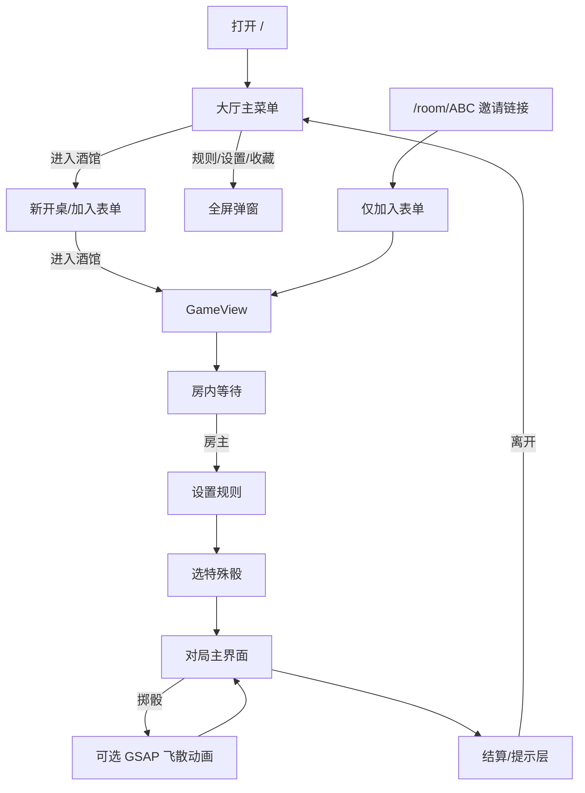

# KCD2 Farkle — 界面结构评审说明

> 供产品/设计/开发评审当前 UI 实现与效果图差异。  
> **效果图：** [ui-reference-mockup.png](./ui-reference-mockup.png)  
> **设计规范：** [DESIGN.md](./DESIGN.md)  
> **开发备忘：** [Memory.md](../../Memory.md)

**本地预览：** `yarn worker:dev` + `yarn dev` → http://localhost:5173

---

## 1. 整体架构

```text
用户浏览器
    │
    ├─ 前端 (Vite + Svelte 5)          farkle.yixr.uno / localhost:5173
    │     App.svelte
    │       ├─ LobbyView（大厅）
    │       └─ GameView（进房后：等人 → 选骰 → 对局）
    │
    └─ 后端 (Cloudflare Worker)        ws://…/room/{房间号}
          Durable Object（权威计分/掷骰）
```

### 界面相关目录

```text
src/
├── App.svelte
├── app.css                    # 深色 token、烫金按钮
├── views/
│   ├── LobbyView.svelte
│   └── GameView.svelte
├── components/
│   ├── layout/                # Header、ActionBar、TavernAmbience
│   ├── lobby/                 # 主菜单、进房、弹窗
│   ├── game/                  # 对局 UI、DiceBoard、GSAP 掷骰 overlay
│   └── selection/             # 选特殊骰
├── lib/
│   ├── client/gameSession     # UI 唯一状态源
│   ├── assets/diceThemes.json # 36 种主题色/icon
│   ├── assets/diceTextures    # getThemedFaceUrl 等
│   ├── ui/playDiceRollAnimation
│   └── settings/gameSettings  # physicsEnabled（飞散动画开关）
public/dice/{DieId}/           # 主题面 hidden + 1…6 + devil
public/dice/ivory/             # 通用面（图鉴/大厅装饰）
docs/kcd2-farkle/
├── DESIGN.md
├── ui-reference-mockup.png
└── UI-REVIEW.md               # 本文档
```

---

## 2. 用户路径（导航）



---

## 3. 视觉基调

| 项 | 当前实现 | 与效果图差异 |
|----|----------|--------------|
| 背景 | 深木 `#1a120b`，烛光渐变 + 暗角 | 一致：暗酒馆 |
| 顶栏 | 深木 + ♛「骰子酒馆」、房间号、连接态、离开 | 与参考稿中文主标题一致 |
| 主菜单按钮 | `menu-btn` 烫金渐变外框 + 居中图标/文案 | 对齐参考稿；无「今日悬赏」条 |
| 对局 HUD | 左你/右对手 + `public/avatars/*.jpg` | 参考稿为立绘，现为固定 JPG |
| 回合分 | 双羊皮纸卡「本轮累计」「当前回合累积」 | 参考稿单卡+小字预览已拆双卡 |
| 表单/底栏 CTA | `.btn-gilded` 全宽「进入酒馆」等 | 接近效果图金边按钮 |
| 骰子 | 骨色 SVG；特殊骰仅 registry **描边色** | 效果图为 3D 多材质，我们 2D |
| 选中 | 上浮 + 金边 + 淡蓝光晕 | 效果图蓝色光圈更明显 |
| 字体 | Cinzel Decorative + Noto Serif SC + JetBrains Mono | 效果图曾提 MedievalSharp 数字 |

---

## 4. 界面线框

### 4.1 大厅 — 主菜单

**路由：** `/`  
**组件：** `MainMenu`、`Header`、`TavernAmbience`、footer

```text
┌─────────────────────────────────────┐
│ ♛ 骰子酒馆              [连接] [离开]  │
├─────────────────────────────────────┤
│         （TavernAmbience 烛光）       │
│              ♛                       │
│           骰子酒馆                    │
│   天国拯救2 · 特罗斯基，1403年         │
│   ┌─────────────────────────────┐   │
│   │         🎲                  │   │
│   │       进入酒馆               │   │  menu-btn--hero
│   │   开始你的骰子对决            │   │  图标/主副标题居中
│   └─────────────────────────────┘   │
│   ┌──────────────┬──────────────┐   │
│   │      📖      │      📜      │   │
│   │   骰子图鉴    │   规则说明    │   │  menu-btn--tile ×2
│   │ 查看所有…    │ 了解游戏…    │   │
│   └──────────────┴──────────────┘   │
│            [ ⚙ 设置 ]               │  menu-btn--settings
├─────────────────────────────────────┤
│      联机 · farkle.yixr.uno          │
└─────────────────────────────────────┘
```

**弹窗（遮罩 + 面板）：** `RulesSheet` · `SettingsPanel` · `DiceCollectionPanel`（35 种骰 + Tab）。

### 4.2 大厅 — 进房

**入口：** 主菜单「进入酒馆」；邀请链 `/room/XXXX` 仅「加入牌局」  
**组件：** `JoinForm`

```text
┌─────────────────────────────────────┐
│  Header                              │
├─────────────────────────────────────┤
│  ← 返回主菜单（邀请链无此按钮）        │
│  ┌───────────────────────────────┐  │
│  │ [新开一桌] | [加入牌局]        │  │
│  │ 旅人昵称: [________]          │  │
│  │ 房间暗号: [______]            │  │
│  │ [    进入酒馆    ]            │  │
│  │ ▼ 怎么玩？                    │  │
│  └───────────────────────────────┘  │
└─────────────────────────────────────┘
```

### 4.3 大厅弹窗（半透明遮罩）

| 弹窗 | 组件 | 功能 |
|------|------|------|
| 规则说明 | `RulesSheet` | 玩法 + 得分表（只读） |
| 设置 | `SettingsPanel` | 物理动画开关；音效音量（音效未接） |
| 骰子图鉴 | `DiceCollectionPanel` | `diceRegistry` 35 种 + 分类 Tab + 详情 |

### 4.4 房内等待

**阶段：** `phase === 'lobby'`（已连 WS，未开局）

```text
┌─────────────────────────────────────┐
│  Header  房间号  ●已连接  [离开]      │
├─────────────────────────────────────┤
│  [复制暗号] [复制链接]  ← 仅房主       │
│  对手已连接 / 牌桌已备好               │
│  房主 ─ 昵称                          │
│  客人 ─ 昵称 / 尚未入座               │
│  [ 设置规则 ]  ← 房主且满员            │
└─────────────────────────────────────┘
```

### 4.5 设置规则（房主）

**组件：** `RulesConfigPanel` — 目标分、特殊骰数量 0–3、「确认规则，开始游戏」；提交后 **正在开局…** 保持面板直至 `phase` 离开 `lobby`（防闪回牌桌等待）

### 4.6 选特殊骰

**阶段：** `dice_selection`  
**组件：** `DiceSelector`、`DiceCard`（六面缩略图 + 权重色）、`DicePickSummary`（己方/对手已选横向摘要）

```text
┌─────────────────────────────────────┐
│  Header + 离开                       │
├─────────────────────────────────────┤
│           选择你的骰子                 │
│  [骰子卡片网格 … 选 N 个]             │
│  [ 确认选择（n/N）]                   │
├─────────────────────────────────────┤
│  底栏：等待对手选骰…                   │
└─────────────────────────────────────┘
```

### 4.7 对局主界面（核心）

**阶段：** `selecting` 等  
**组件：** `GameHud`、`DiceTable`、`DiceBoard`、`TurnScoreCard`、`ActionBar`；叠加 `FloatingScore`、`ComboBanner`、`PhaseOverlay`（**无** `ScoreRulesPanel` / `ThrowPips`）

**手机：**

```text
┌─────────────────────────────────────┐
│ ♛ 骰子酒馆   ABC123   ● 已连接 [离开] │
├─────────────────────────────────────┤
│ [你] 你·昵称  │  目标  │ 对手·昵称 [对] │
│     1200      │  4000  │      800       │  GameHud + JPG
├─────────────────────────────────────┤
│         game-page__stage 垂直居中      │
│  ┌─────────────────────────────┐    │
│  │ 摇出骰子                     │    │
│  │ 点击骰子区域即可重新摇骰       │    │
│  │  ┌──┬──┬──┐                 │    │
│  │  │🎲│🎲│🎲│  mobile 3×2     │    │
│  │  ├──┼──┼──┤                 │    │
│  │  │🎲│🎲│🎲│                 │    │
│  │  └──┴──┴──┘                 │    │
│  └─────────────────────────────┘    │
│   ┌──────────┐  ┌──────────────┐    │
│   │ 本轮累计  │  │ 当前回合累积  │    │  panel-parchment ×2
│   │  +1050    │  │    350       │    │
│   └──────────┘  └──────────────┘    │
├─────────────────────────────────────┤
│ [重新掷骰][计分并再次掷出][计分并跳过]   │  仅「重新掷骰」烫金强调
└─────────────────────────────────────┘
```

**桌面（≥768px）：**

```text
┌──────────────────────────────────────────────────┐
│  … Header …                                       │
│  [你] … │ 目标 │ … [对手]     ← 同手机，字号略大    │
│              （stage 居中）                        │
│  ┌────────────────────────────────────────────┐ │
│  │ 摇出骰子 · 提示                              │ │
│  │  [🎲][🎲][🎲][🎲][🎲][🎲]  六枚横排 DiceBoard │ │
│  └────────────────────────────────────────────┘ │
│     [ 本轮累计 +N ]    [ 当前回合累积 score ]      │
│  [ 重新掷骰 ]  [ 计分并再次掷出 ]  [ 计分并跳过 ]    │
└──────────────────────────────────────────────────┘
```

对局内**无** `ScoreRulesPanel` / `ThrowPips`；完整得分表见大厅 `RulesSheet`。

**掷骰：** 己方回合且 `rollCount` **相对上一值递增**时触发 `playDiceRollAnimation`（约 0.85s：收拢→飞散→回槽）；`GameView` 用 `prevRollCount` 守卫，避免进 `selecting`（`rollCount===0`）或重连误开 `physicsRolling` 导致骰盘空白。设置关闭「掷骰飞散动画」或 `prefers-reduced-motion` → CSS `medievalRoll`。动画期间隐藏活动区 `shortName`。

**首掷背面：** 进入对局（含选完特殊骰、金币定先后）且尚未掷骰时，盘内须显示 **6 枚** `face-hidden` 占位（`rollCount===0 && turnScore===0`）；特殊骰槽位显示对应主题 icon，其余为普通骰背面。

**反馈：** 保留得分 `+N` 上浮；大组合横幅；爆点/Hot Dice/胜负全屏 overlay。

### 4.8 非己方回合

底栏：「等待 {对手} 掷骰…」，三按钮隐藏。

### 4.9 结算

`PhaseOverlay`（`game_over`）：**终局结算卡** — 胜负标题与副标题、决胜一击（`+分 → 总分/目标` + 收分骰）、双方终局比分（胜者 ♛）、离开 / 再来一局（房主）。达标收分无前置 `turn_end` toast。

### 4.10 离席

`PartnerLeftOverlay`：对手/房主离席通知（~3.2s 自动消失 + 进度条）。对局中展示离席前比分。房主离席 → 客人自动回主菜单；客人离席 → 房主留桌等人。**非**右上角 error toast。

主动点「离开」：`App` SPA `replaceState('/')` 回大厅，不整页刷新。

---

## 5. 组件与阶段对照

| GamePhase | 界面 |
|-----------|------|
| `lobby` | 房内等待卡片 |
| `dice_selection` | `DiceSelector`（有特殊骰时开局先进此阶段） |
| `turn_order` | `CoinFlipOverlay`（无特殊骰：开局后；有特殊骰：双方选完骰后） |
| `selecting` | 对局主界面 |
| `bust` / `hot_dice` / `turn_end` | `PhaseOverlay` 居中 toast，~1.2s 自动消失 |
| `game_over` | `PhaseOverlay` 终局结算卡 + 离开/重开 |
| 对手离席 | `PartnerLeftOverlay`（phase 已回 `lobby`） |
| `rps` / `draft_rps` | 占位「敬请期待」 |

---

## 6. 评审建议关注点

### 信息架构

- 大厅：主菜单四按钮 → 再进 Tab 表单，是否合并一步？
- 对局 HUD：已用 `public/avatars/` 固定 JPG；是否再上立绘/自定义头像？

### 对局布局

- 对局内得分表已移除（见大厅规则）；效果图右侧常显得分表未做
- ~~`ThrowPips`~~ 已从 UI 移除
- 底栏三键：重新掷骰 / 计分并再次掷出 / 计分并跳过

### 视觉

- 选中光晕：金+蓝 vs 纯蓝圈
- 骰子：对局已分 36 套主题 SVG；图鉴六面是否改为主题预览；是否再上 3D
- 主菜单：是否要酒馆背景图（当前纯 CSS）

### 占位 / 未做

- 主菜单「今日悬赏」、老板立绘、酒馆传闻侧栏（参考稿未实现）
- 底栏成就/日记图标
- 音效、粒子飞分、骰杯倒出
- `rps` / `draft_rps`

---

## 7. 评审检查清单

- [ ] `/` 主菜单 + 三个弹窗
- [ ] 双标签页：创建房间 → 加入 → 满员 → 规则 → 选骰
- [ ] 完整一局：掷骰 → 保留 → 收分 → 胜负
- [ ] 设置关闭「掷骰飞散动画」对比
- [ ] 手机 375px + 桌面 1280px
- [ ] 与 [ui-reference-mockup.png](./ui-reference-mockup.png) 并排对照

---

## 8. 变更记录

| 日期 | 说明 |
|------|------|
| 2026-06-03 | 初版：v2 深色 UI + SVG 骰 + Pixi 物理（已废弃） |
| 2026-06-04 | 主菜单参考稿按钮；GameHud 左你右对手 + JPG 头像；TurnScoreCard 双卡；移除对局 ScoreRulesPanel/ThrowPips |
| 2026-06-04 | §4 / DESIGN §5 / Memory §3.5 线框全文对齐现实现 |
| 2026-06-04 | 主题骰 SVG + GSAP 掷骰；同步 DESIGN §v2 补充与目录结构 |
